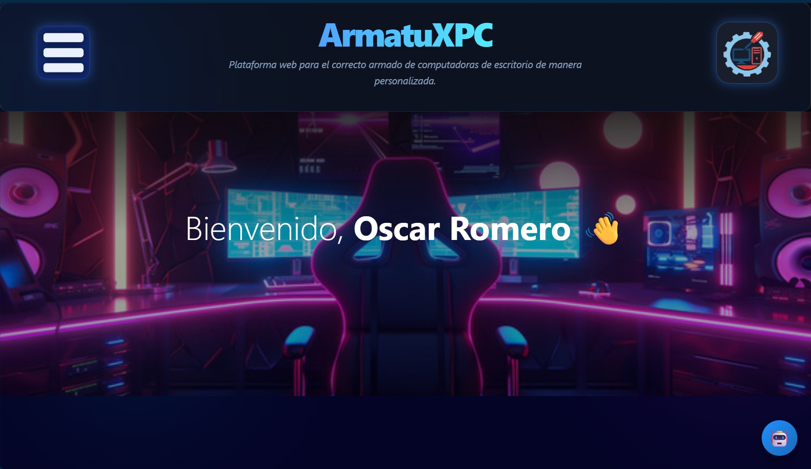
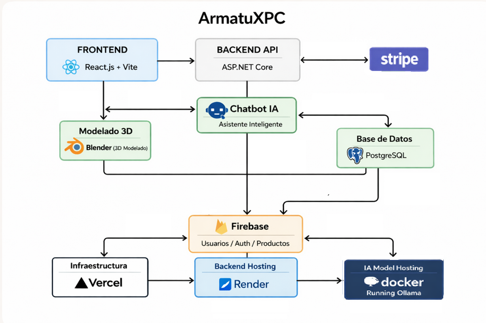
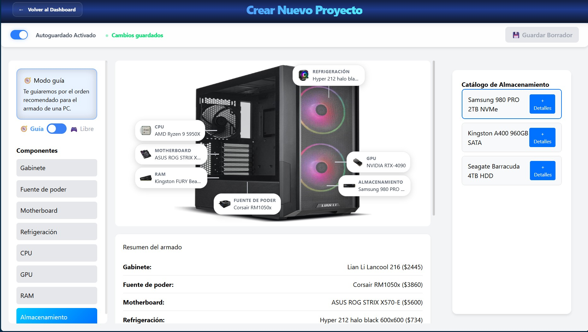
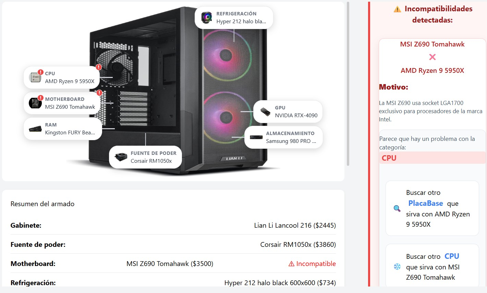
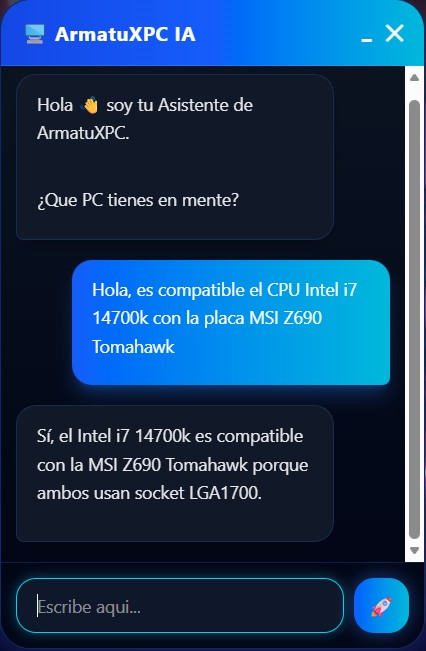
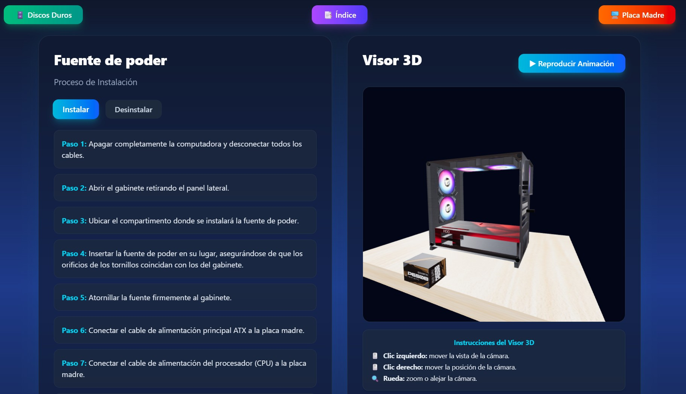
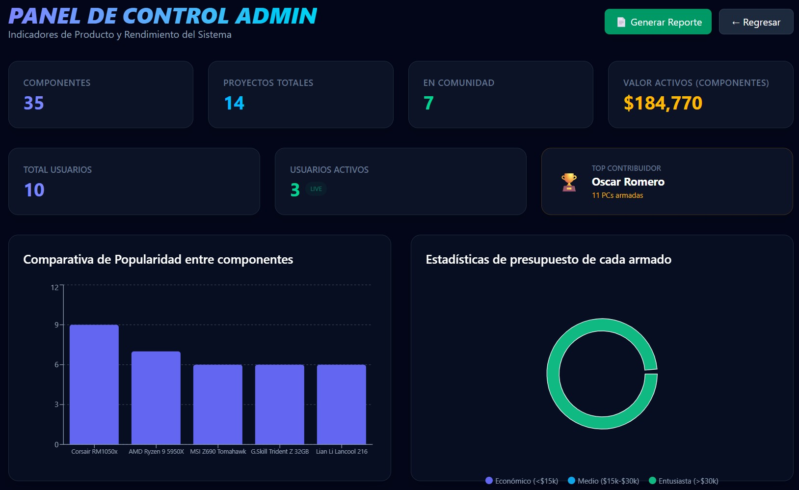

# 🚀 ArmatuXPC Platform

Interactive web platform for custom desktop PC assembly with an AI-powered mentor, real-time compatibility validation, and 3D visualization.

<p align="center">
  
</p>

---

# 📌 Overview

ArmatuXPC is a full-stack web platform designed to help users build custom desktop computers interactively while learning hardware compatibility concepts through an AI-assisted experience.

The platform combines:

- 🧠 AI-assisted recommendations
- 🔧 Real-time compatibility validation
- 🎮 Interactive 3D visualization
- ☁️ Cloud-native deployment
- 🔐 Authentication and user management
- 📦 Component catalog administration

This project was developed as a software engineering initiative focused on scalable architecture, intelligent assistance, and educational user experience.

---

# ✨ Key Features

## 🖥️ Custom PC Builder
- Interactive component selection
- Dynamic hardware configuration
- Real-time build updates

## 🔍 Compatibility Validation Engine
- CPU ↔ Motherboard socket validation
- RAM type compatibility checks
- Power consumption vs PSU capacity validation
- Conflict detection with guided suggestions

## 🤖 AI Digital Mentor
- Conversational assistant powered by Ollama
- Context-aware hardware recommendations
- Educational explanations for beginners
- Streaming responses using Server-Sent Events (SSE)

## 🎮 3D Visualization
- Real-time PC visualization using Three.js
- Interactive rendering and component previews

## 🔐 Authentication & User Management
- Firebase Authentication
- Role-based access control
- Firestore integration

## ☁️ Cloud Deployment
- Frontend deployed on Vercel
- Backend deployed on Render
- Dockerized services
- CI/CD workflows with GitHub Actions

---

# 🏗️ System Architecture

<p align="center">
  
</p>

---

# 🧠 AI Integration

ArmatuXPC integrates a hybrid AI assistant capable of:

- Understanding natural language queries
- Recommending compatible components
- Explaining technical concepts
- Detecting incompatibilities
- Streaming responses in real time

### Technologies Used
- Ollama
- llama3.2
- NLP-based prompt engineering
- Rule-based compatibility system
- SSE streaming architecture

---

# 🛠️ Tech Stack

## Frontend
- React
- Vite
- Tailwind CSS
- Three.js

## Backend
- ASP.NET Core (.NET 8)
- Entity Framework Core
- REST API Architecture
- Server-Sent Events (SSE)

## Database
- PostgreSQL
- Firebase Firestore

## Authentication & Cloud Services
- Firebase Authentication
- Firebase Storage
- Firebase Functions

## DevOps & Deployment
- Docker
- Docker Compose
- GitHub Actions
- Vercel
- Render
- ngrok

---

# 📂 Project Structure

```text
ArmatuXPC/
│
├── frontend-vite/              # React + Vite frontend
│
├── backend/
│   └── ArmatuXPC.Backend/      # ASP.NET Core backend
    └── IA/                     # AI services and NLP logic
├── docker-compose-development.yml
├── docker-compose-production.yml
│
└── README.md
```

---

# ⚙️ Local Installation

## 1️⃣ Clone Repository

```bash
git clone https://github.com/OscarDs7/armatuxpc.git
cd armatuxpc
```

---

## 2️⃣ Frontend Setup

```bash
cd frontend-vite
npm install
npm run dev
```

Frontend:
```text
http://localhost:5173
```

---

## 3️⃣ Backend Setup

```bash
cd backend/ArmatuXPC.Backend
dotnet restore
dotnet run
```

Backend:
```text
http://localhost:5031/api
```

---

## 4️⃣ Docker Environment

```bash
docker compose -f docker-compose-development.yml up --build
```

Docker Backend:
```text
http://localhost:5001/api
```

---

# 🌐 Production Deployment

## Frontend
Vercel:
```text
https://armatuxpc26.vercel.app/
```

## Backend
Render:
```text
https://armatuxpc-backend.onrender.com/
```

## AI Service
ngrok Tunnel:
```text
https://vacancy-impulse-sixtyfold.ngrok-free.dev
```

---

# 🚀 DevOps & Infrastructure

### Implemented Features
- ✅ Dockerized services
- ✅ CI/CD pipelines
- ✅ Automatic EF Core migrations
- ✅ Cloud deployment
- ✅ Remote AI integration
- ✅ Environment variable management
- ✅ PostgreSQL persistence
- ✅ Firebase integration

---

# 📊 Engineering Highlights

## Software Engineering Concepts Applied
- Clean Architecture principles
- Dependency Injection
- RESTful API design
- Real-time streaming communication
- Compatibility rule engines
- Cloud-native deployment
- Full-stack development workflow

## Scalability Goals
- Modular backend services
- Expandable compatibility engine
- AI abstraction layer
- Multi-service deployment architecture

---

# 👥 Development Team

- Oscar Eduardo Romero Escamilla
- Eduardo Rafael Medina Rubio
- Bryan Nicolás Soto Rodríguez
- Diego Jahir Corona Gómez

---

# 📸 Screenshots

> Add platform screenshots here:
- **PC Builder:**
  <p align="center">
    
  </p>
- **Compatibility alerts:**
  <p align="center">
    
  </p>
- **AI assistant:**
  <p align="center">
    
  </p>
- **3D visualization:**
  <p align="center">
    
  </p>
- **Admin dashboard:**
    <p align="center">
    
  </p>

---

# 🚀 Future Improvements

- Advanced recommendation systems
- Benchmark-based component scoring
- AI-generated build optimization
- Multi-language support
- Advanced 3D assembly simulation
- Performance analytics dashboard
- Preventive maintenance on the assemblies
- Educational modules for fun learning in assembling desktop computers

---

# 📄 License

This project was developed for educational and software engineering purposes.

---

# ⭐ Project Status

✅ Active Development  
🚀 Full-stack architecture implemented  
🤖 AI assistant operational  
☁️ Production deployment available
